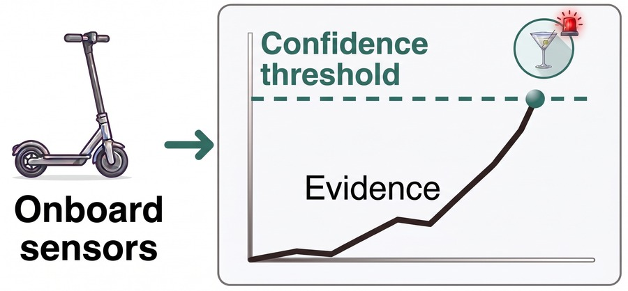

# In-Ride Impairment Detection

<p align="center">
  <a href="LICENSE"></a>
  <a href="LICENSE-CC-BY-4.0.txt"></a>
  
</p>

<p align="center">
  
</p>

Code and data to reproduce the results from "In-Ride Alcohol-Impairment Detection in E-Scooterists with False-Alarm Control".

Rather than testing the rider before the trip, the detector monitors inertial and throttle signals while the ride is underway and raises an alarm once the accumulated evidence of impairment is sufficient, with a provable bound on the false-alarm rate. It is evaluated on 141 rides by 25 participants, each riding sober and at two target blood alcohol concentrations, and can run in real time on an STM32 microcontroller.

## Table of Contents
- [In-Ride Impairment Detection](#in-ride-impairment-detection)
  - [Table of Contents](#table-of-contents)
  - [Setup](#setup)
  - [Experiments](#experiments)
  - [Methods](#methods)
  - [False-alarm guarantee](#false-alarm-guarantee)
  - [Results](#results)
  - [On-device latency (STM32)](#on-device-latency-stm32)
  - [Paper](#paper)


## Setup
The data in `data/` is tracked with [Git LFS](https://git-lfs.com), so install it before cloning:

```bash
git lfs install
git clone git@github.com:voiapp/online-impairment-detection.git
cd online-impairment-detection
```

If you cloned without LFS, the `.parquet` files will be small text pointers instead of real data; run `git lfs install && git lfs pull` in the clone to fetch them.

```bash
python -m venv .venv
source .venv/bin/activate
pip install -r requirements.txt
pre-commit install
```

## Experiments
Run all experiments. Rendered notebooks are written to `output/`, and the glued values are collected into `output/results.csv`:

```bash
./run_experiments.sh
```

Precomputed results (rendered notebooks and `results.csv`) are available in `results/`.

## Methods
Each ride is scored from permutation entropy of the IMU + throttle channels (within-subject
centered), with a logistic regressor evaluated leave-one-participant-out. The detectors differ
only in how the per-ride score is turned into an alarm:

- **`avg_cal_lr` (headline)** — online running mean of the impairment probability, shrunk by `k`
  pseudo-windows toward the sober baseline, with a per-ride conformal-recalibrated threshold at `α`.
- **`jump_cal_lr`** — betting martingale (Simple Jumper) on conformal p-values, recalibrated threshold.
- **`jump_ville_lr`** — same martingale with the anytime-valid Ville threshold `log(1/α)`.
- **`windowed_lr`** — raw per-window probability against a fixed `1−α` threshold.
- **`batch_lr`** — single end-of-ride decision (no detection time).

## False-alarm guarantee

The recalibrated detectors (`avg_cal_lr`, `jump_cal_lr`) get an anytime-valid FAR bound. Each ride is summarized by the peak of its running evidence, and the threshold is the empirical $(1-\alpha)$ quantile of the peaks over sober calibration rides. Under exchangeability, a crossing at any step means the peak crosses, which lifts the single-test-point bound of inductive conformal prediction (ICP) to every step of the ride.

## Results
**False-alarm control** (Sober FAR `[95% CI]`, ideal = α). Only the recalibrated/batch detectors
keep FAR within the bound; the fixed-threshold and Ville baselines exceed it badly.

| method        | α=0.023          | α=0.05           | α=0.10           | α=0.20           |
| ------------- | ---------------- | ---------------- | ---------------- | ---------------- |
| avg_cal_lr    | 0.02 [0.00–0.07] | 0.04 [0.00–0.11] | 0.09 [0.02–0.17] | 0.18 [0.07–0.29] |
| jump_cal_lr   | 0.02 [0.00–0.07] | 0.04 [0.00–0.11] | 0.11 [0.02–0.22] | 0.18 [0.07–0.31] |
| batch_lr      | 0.02 [0.00–0.07] | 0.02 [0.00–0.07] | 0.02 [0.00–0.07] | 0.02 [0.00–0.07] |
| windowed_lr   | 0.11 [0.04–0.20] | 0.27 [0.13–0.42] | 0.44 [0.30–0.58] | 0.80 [0.66–0.93] |
| jump_ville_lr | 0.67 [0.52–0.80] | 0.71 [0.58–0.84] | 0.78 [0.64–0.91] | 0.87 [0.77–0.95] |

**Detection rate + time** among the FAR-controlling methods (α=0.023; `[ ]` = 95% CI, `( )` = IQR).

| method      | High DR [95% CI] | High time, s (IQR) | Low DR [95% CI]  | Low time, s (IQR) |
| ----------- | ---------------- | ------------------ | ---------------- | ----------------- |
| avg_cal_lr  | 0.91 [0.82–0.98] | 25 (22–28.75)      | 0.50 [0.36–0.64] | 27 (22–35)        |
| jump_cal_lr | 0.65 [0.50–0.79] | 54 (52.25–56.5)    | 0.14 [0.04–0.24] | 60 (56–63.5)      |
| batch_lr    | 0.96 [0.88–1.00] | —                  | 0.24 [0.12–0.36] | —                 |

A paired **McNemar exact test** (`notebooks/mcnemar_test.ipynb`) confirms `avg_cal_lr` detects
significantly more often than `jump_cal_lr` at this operating point: High p=0.002, Low p<0.001.

**Shrinkage sweep** for `avg_cal_lr` (α=0.023; FAR constant at 0.02). Small `k` alarms instantly
but unreliably; detection rate peaks around k=10, then declines as larger `k` delays alarms.

| k  | High DR [95% CI] | High time, s (IQR) | Low DR [95% CI]  | Low time, s (IQR) |
| -- | ---------------- | ------------------ | ---------------- | ----------------- |
| 0  | 0.63 [0.48–0.78] | 10 (10–10)         | 0.22 [0.12–0.34] | 10 (10–10)        |
| 10 | 0.91 [0.82–0.98] | 25 (22–28.75)      | 0.50 [0.36–0.64] | 27 (22–35)        |
| 20 | 0.89 [0.80–0.96] | 29 (26–33)         | 0.46 [0.32–0.60] | 34 (27.5–41.5)    |
| 30 | 0.85 [0.74–0.94] | 33 (30–36.5)       | 0.38 [0.24–0.52] | 41 (33–50)        |

## On-device latency (STM32)
The `avg_cal_lr` detection cycle ported to bare metal — STM32CubeIDE project in `stm32/` (app logic in `stm32/Core/Src/main.c`). Per-cycle latency over 1000 timed cycles:

```
per-cycle latency: mean=262.26 ms  std=0.91 ms  min=260 ms  max=265 ms
```

Configuration:

| Item         | Value                                                                                  |
| ------------ | -------------------------------------------------------------------------------------- |
| Board / MCU  | NUCLEO-H533RE — STM32H533RET6 (Cortex-M33, single-precision FPU)                       |
| System clock | 32 MHz (HSI ÷2, no PLL — default reset clock), ICACHE enabled                          |
| Toolchain    | STM32CubeIDE 1.19.0, STM32Cube FW_H5 V1.5.1                                            |
| Workload     | `N_CYCLES=1000`, `PE_W=1000`, `PE_S=100`; timing via `HAL_GetTick()` (1 ms resolution) |

## Paper
The preprint and citation details are coming soon.
